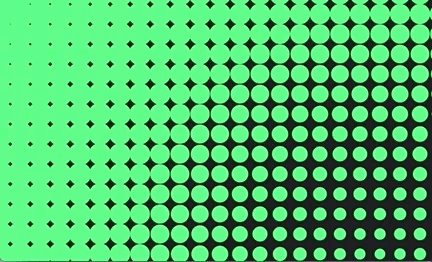
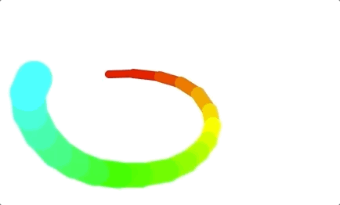
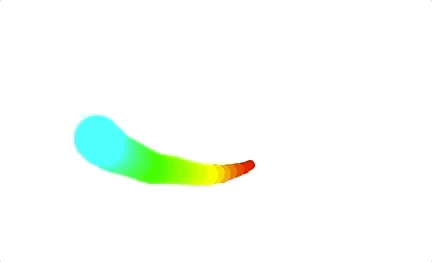
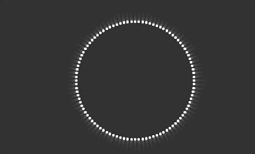

# Experiments with p5js

## Distance Grid

## Distance Grid | Sin Waves

## Follow

## Follow | Rainbow | Scripted

## Follow | Rainbow

## Platformer | Part 1

## Platformer | Part 2

## Sin | Circle | Pulsing

## Sin | Circle

## Sin | Wave

